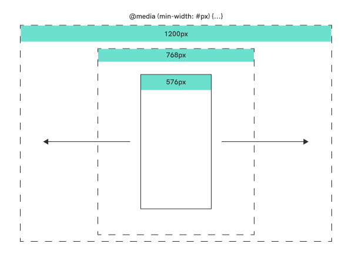
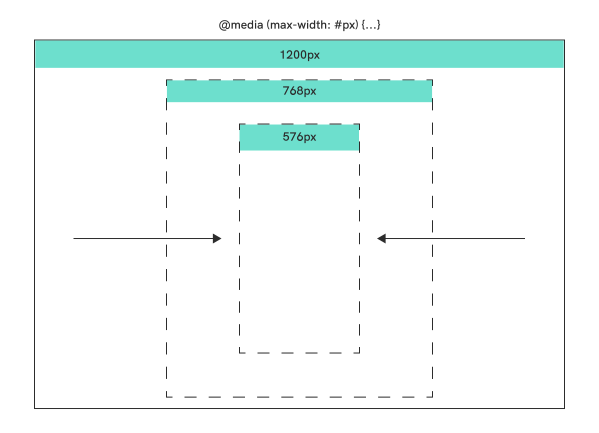

# Responsive design

Disse eksemplene fokuserer på `@media` breakpoint metoden for å oppnå responsivt design — da [fluid design](https://medium.com/@mchisti/two-css-tricks-thatll-make-your-site-fully-responsive-5f9efba4015e) er pensum i webutvikling.

&nbsp;

## Viewport

For å aktivere muligheten til å bruke denne metoden er det viktig gi instrukser til nettleseren om hvilken størrelse nettsiden skal vises i. Dette gjør du ved å legge inn koden under: 

```html
<head>
  <meta name="viewport" content="width=device-width, initial-scale=1.0" />
</head>
```
**`viewport`** - er en attributt til `<meta>`-elementet

**`width`** - forteller hvor stor nettsiden skal vises — `width=device-width` vil gi fullvidde

**`initial-scale`** - gir beskjed om initiell zoom, `1.0` er original størrelse, `2.0` er zoomet dobbelt så langt inn.

&nbsp;

## Media Queries | `@media`-breakpoint

 **Hva er det?**

  - En måte å si at denne stylen skal kun vises når visse krav er oppfylt — f.eks at nettsiden er minst 928px bred
  
 **Hva brukes det til?**
 
  - Som oftest brukes det til å tilpasse designet på f.eks telefon til desktop.
  - Det kan også brukes til andre ting, f.eks. endre designet om man skal printe nettsiden.


&nbsp;

## De vanligste tilnærmingene

`@media only screen and (Min/max-width= #px){...}`

&nbsp;

### Min-width (Mobile first)



```css
  /*Mindre enn 576px*/
@media only screen and (min-width: 576px) {
  /*Større enn 576px*/
  body{
    
    }
 }
@media only screen and (min-width: 768px) {
  /*Større enn 768px*/
  body{
    
    }
 }
@media only screen and (min-width: 1200px) {
  /*Større enn 1200px*/
  body{

  }
 }
```

&nbsp;

### Max-width (Desktop first)



```css
/*Større enn 1200px*/
@media only screen and (max-width: 1200px) {
  /*Mindre enn 1200px*/
  body{
    
    }
  }
@media only screen and (max-width: 768px) {
  /*Mindre enn 768px*/
  body{
    
    }
 }
@media only screen and (max-width: 576px) {
  /*Mindre enn 576px*/
  body{
    
  }
}
```
&nbsp;

&nbsp;

## Read more:
- Book: Learning Responsive Web Design — a beginner's guide — By Clarissa Peterson
- [MDN web docs - Official documentation](https://developer.mozilla.org/en-US/docs/Web/CSS/Media_Queries/Using_media_queries)
- [W3School about Responsive webdesign](https://www.w3schools.com/css/css_rwd_mediaqueries.asp)
- [CSS-Tricks' list of device sizes](https://css-tricks.com/snippets/css/media-queries-for-standard-devices/)
- [Mohammed Christi's explenation of Fluid design and `@media` breakpoints](https://medium.com/@mchisti/two-css-tricks-thatll-make-your-site-fully-responsive-5f9efba4015e)